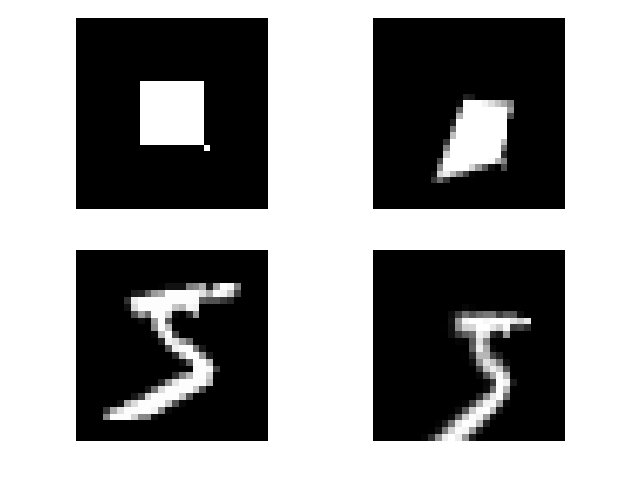
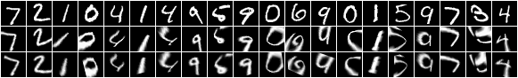
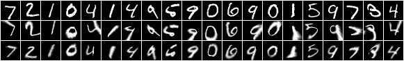
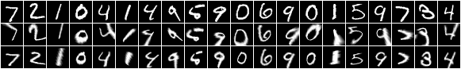
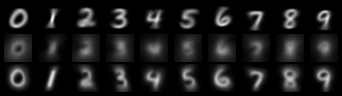
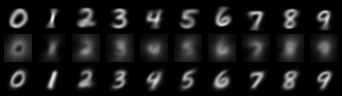
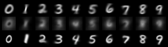
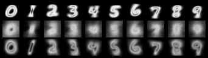
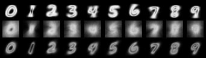
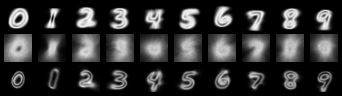

# Spatial Transformer Networks

Reimplementations of:
* [Spatial Transformer Networks](https://arxiv.org/abs/1506.02025)
* [Inverse Compositional Spatial Transformer Networks](https://chenhsuanlin.bitbucket.io/inverse-compositional-STN/paper.pdf)

Although implementations already exists, this focuses on simplicity and
ease of understanding of the vision transforms and model.

## Results

During training, random homography perturbations are applied to each image in the minibatch. The perturbations are composed by component transformation (rotation, translation, shear, projection), the parameters of each sampled from a uniform(-1,1) * 0.25 multiplicative factor.

Example homography perturbation:<br>


### Test set accuracy:

| Model | Accuracy | Training params |
| ----- | -------- | ----- |
| Basic affine STN | 91.59%  | 10 epochs at learning rate 1e-3 (classifier and transformer)|
| Homography STN | 93.30% | 10 epochs at learning rate 1e-3 (classifier and transformer) |
| Homography ICSTN | 97.67%  | 10 epochs at learning rate 1e-3 (classifier) and 5e-4 (transformer) |


### Sample alignment results:

#### Basic affine STN

| Image | Samples |
| --- | --- |
| original   <br> perturbed <br/> transformed |  |

#### Homography STN

| Image | Samples |
| --- | --- |
| original <br> perturbed <br> transformed |  |


#### Homography ICSTN

| Image | Samples |
| --- | --- |
| original <br> perturbed <br> transformed |  |


### Mean and variance of the aligned results (cf Lin ICSTN paper)

#### Mean image
| Image | Basic affine STN | Homography STN | Homography ICSTN |
| --- | ---------------- | -------------- | ---------------- |
| original <br> perturbed <br> transformed |  |  |  |

#### Variance
| Image | Basic affine STN | Homography STN | Homography ICSTN |
| --- | ---------------- | -------------- | ---------------- |
| original <br> perturbed <br> transformed |  |  |  |


## Usage

To train model:
```
python train.py --output_dir=[path to params.json]
                --restore_file=[path to .pt checkpoint if resuming training]
                --cuda=[cuda device id]
```
`params.json` provides training parameters and specifies which spatial transformer module to use:
1. `BasicSTNModule` -- affine transform localization network
2. `STNModule` -- homography transform localization network
3. `ICSTNModule` -- homography transform localization netwokr (cf Lin,
   ICSTN paper)

To evaluate and visualize results:
```
python evaluate.py --output_dir=[path to params.json]
                   --restore_file=[path to .pt checkpoint]
                   --cuda=[cuda device id]
```

## Dependencies
* python 3.6
* pytorch 0.4
* torchvision
* tensorboardX
* numpy
* matplotlib
* tqdm


## Useful resources
* https://github.com/chenhsuanlin/inverse-compositional-STN
